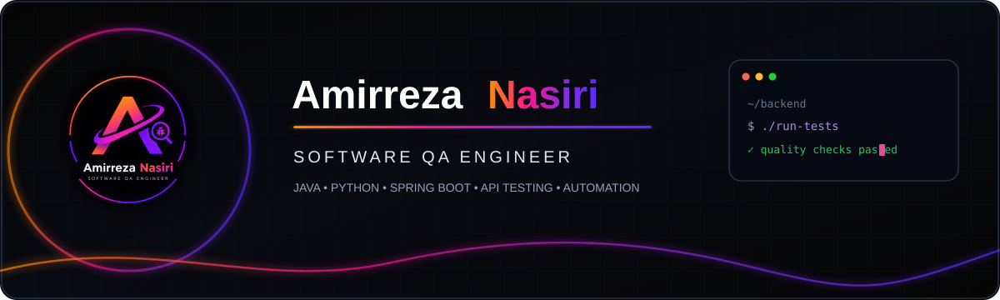

<div align="center">

<!-- Animated Neon Banner -->


<!-- Animated Typing -->
<a href="https://git.io/typing-svg">
  
</a>

<br><br>

<br>

<a href="mailto:amyrrdansyry1385@gmail.com">

</a>
&nbsp;
<a href="https://www.linkedin.com/in/amirreza-nasiri-a7a670427/">

</a>
&nbsp;
<a href="https://github.com/AmirrezaNasiri-math">

</a>

<br><br>


&nbsp;

&nbsp;

&nbsp;


</div>

---

## ⚡ About Me

```yaml
name: Amirreza Nasiri
role: Software QA Engineer
focus: QA Automation • API Testing • Software Quality
stack: Java • Python • Playwright • Selenium • REST Assured
currently_learning: Spring Boot • Backend Development • CI/CD
certification: ISTQB CTFL
```

- 🧪 Test Automation & API Testing
- 🔍 Functional, Regression & Negative Testing
- 🔌 Postman & REST Assured
- ⚡ Performance Testing with JMeter
- 🔄 CI/CD automation & quality gates
- ☕ Java & Spring Boot backend development

---

## 🧰 Tech Stack

### 🧪 Automation & API Testing

<div align="center">


&nbsp;&nbsp;

&nbsp;&nbsp;

&nbsp;&nbsp;


</div>

<p align="center">
Playwright &nbsp;•&nbsp; Selenium &nbsp;•&nbsp; Postman &nbsp;•&nbsp; REST Assured &nbsp;•&nbsp; TestNG &nbsp;•&nbsp; Pytest
</p>

---

### 💻 Languages

<div align="center">


&nbsp;&nbsp;

&nbsp;&nbsp;

&nbsp;&nbsp;

&nbsp;&nbsp;

&nbsp;&nbsp;


</div>

---

### ☕ Backend

<div align="center">


&nbsp;&nbsp;

&nbsp;&nbsp;

&nbsp;&nbsp;

&nbsp;&nbsp;


</div>

---

### ⚙️ DevOps & CI/CD

<div align="center">


&nbsp;&nbsp;

&nbsp;&nbsp;

&nbsp;&nbsp;

&nbsp;&nbsp;

&nbsp;&nbsp;


</div>

---

### 📊 QA & Reporting

<div align="center">


&nbsp;&nbsp;

&nbsp;&nbsp;

&nbsp;&nbsp;

</div>

<p align="center">
STLC &nbsp;•&nbsp; Risk-Based Testing &nbsp;•&nbsp; BDD &nbsp;•&nbsp; POM &nbsp;•&nbsp; RCA
</p>

---

## 🚀 Featured Projects

<table>
<tr>

<td width="50%" align="center">

### 🎭 Playwright Automation


**TypeScript · Playwright · POM**

<br>

UI automation framework with
reusable Page Objects and
cross-browser testing.

<br>

`UI Testing` `API Testing` `Regression`

</td>

<td width="50%" align="center">

### 🔌 API Testing


**Java · REST Assured · TestNG**

<br>

Automated REST API testing
with functional and negative
test scenarios.

<br>

`REST API` `JSON` `Authentication`

</td>

</tr>

<tr>

<td width="50%" align="center">

### ⚡ JMeter Performance


**JMeter · Groovy**

<br>

Load and stress testing
with parameterized scenarios
and performance reports.

<br>

`Load` `Stress` `Performance`

</td>

<td width="50%" align="center">

### ☕ Spring Boot


**Java · Spring Boot · PostgreSQL**

<br>

Backend development with
REST APIs, JPA and relational
databases.

<br>

`REST API` `JPA` `PostgreSQL`

</td>

</tr>
</table>

---

## 🧠 Testing Knowledge

<div align="center">

`STLC` · `Risk-Based Testing` · `Shift-Left` · `BDD` · `POM`

`Functional Testing` · `Regression` · `Smoke` · `Negative Testing`

`Boundary Value Analysis` · `Equivalence Partitioning` · `RCA`

</div>

---

## 🏆 Certification

<div align="center">

### ISTQB® Certified Tester – Foundation Level

</div>

---

## 🐍 Contribution Snake

<div align="center">


</div>

---

## 📊 GitHub Stats

<div align="center">


</div>

---

## 🏅 Beyond Code

<div align="center">

🎓 **B.Sc. Computer Engineering**

&nbsp;•&nbsp;

🧪 **ISTQB CTFL**

&nbsp;•&nbsp;

📚 **Software Testing**

&nbsp;•&nbsp;

☕ **Java & Backend Development**

&nbsp;•&nbsp;

🐧 **Linux**

</div>

---

<div align="center">

<a href="mailto:amyrrdansyry1385@gmail.com">Email</a>
&nbsp;·&nbsp;
<a href="https://www.linkedin.com/in/amirreza-nasiri-a7a670427/">LinkedIn</a>
&nbsp;·&nbsp;
<a href="https://github.com/AmirrezaNasiri-math">GitHub</a>

<br><br>

<i>Building quality into software, one test at a time.</i>

</div>
